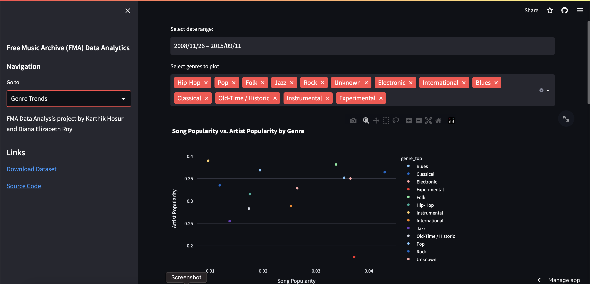

# FMA Data Visualization


The Free Music Archive (FMA) is an open and easily accessible repository of free, high-quality music. The dataset provided by the FMA contains information on over 100,000 tracks and their corresponding audio features. This project aims to create a big data visualization of this dataset using Streamlit and Plotly.

The goal of this project is to provide an interactive and visually engaging way to explore the FMA dataset. Users will be able to select different tracks based on a variety of criteria, such as genre, tempo, and energy level. They will also be able to visualize the data in a variety of ways, including scatterplots, heatmaps, and histograms.


## Features

- A user interface built using Streamlit, a powerful tool for creating interactive data visualizations.
- A backend server that processes the FMA dataset and responds to user requests.
- Interactive visualizations created using Plotly, a popular visualization library for Python.
- The ability to filter and sort tracks based on a variety of criteria, including genre, tempo, and energy level.
- The ability to view track information and audio features, such as duration and loudness.
- The ability to visualize the data in a variety of ways, including scatterplots, heatmaps, and histograms.


## Demo

https://karthikhosur-fma-streamlit-app-main-9gv6n3.streamlit.app/

## Run Locally

Clone the project

```bash
  git clone https://github.com/karthikhosur/FMA-Streamlit-App.git
```

Go to the project directory

```bash
  cd FMA-Streamlit-App
```

Install dependencies

```bash
  pip install -r requirements.txt
```

Download the Dataset File 

```bash
  python install.py
```

Start the server

```bash
  streamlit run main.py
```


## Screenshots





## License

[MIT](https://choosealicense.com/licenses/mit/)

